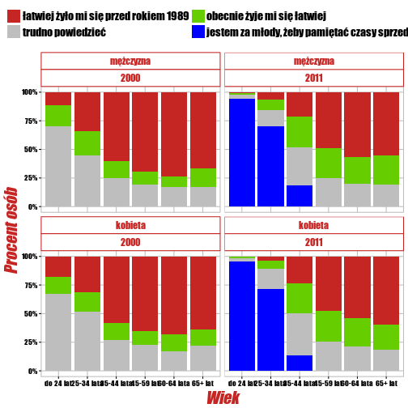
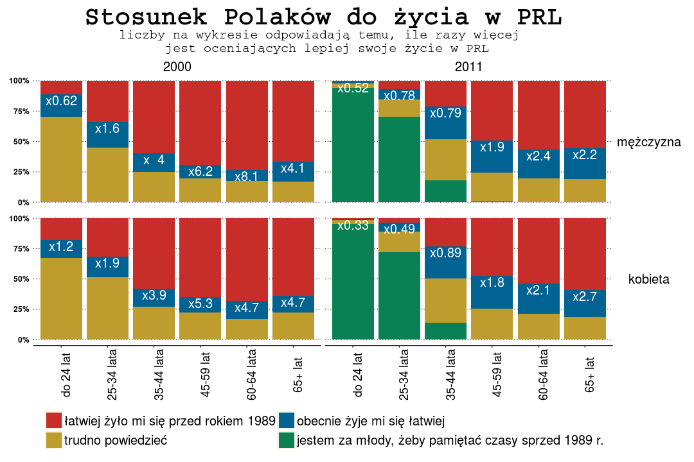
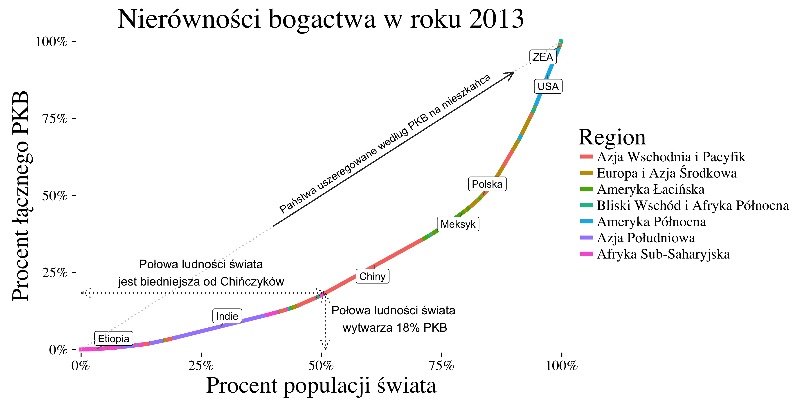
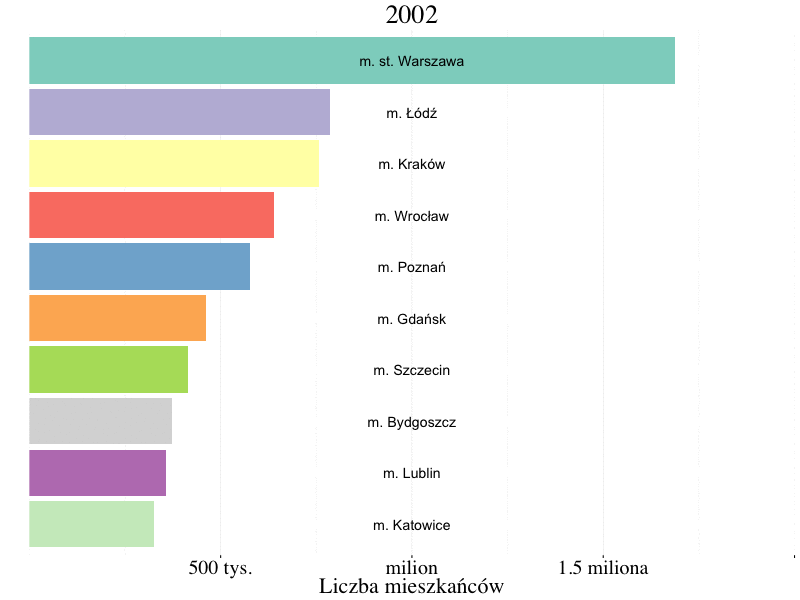
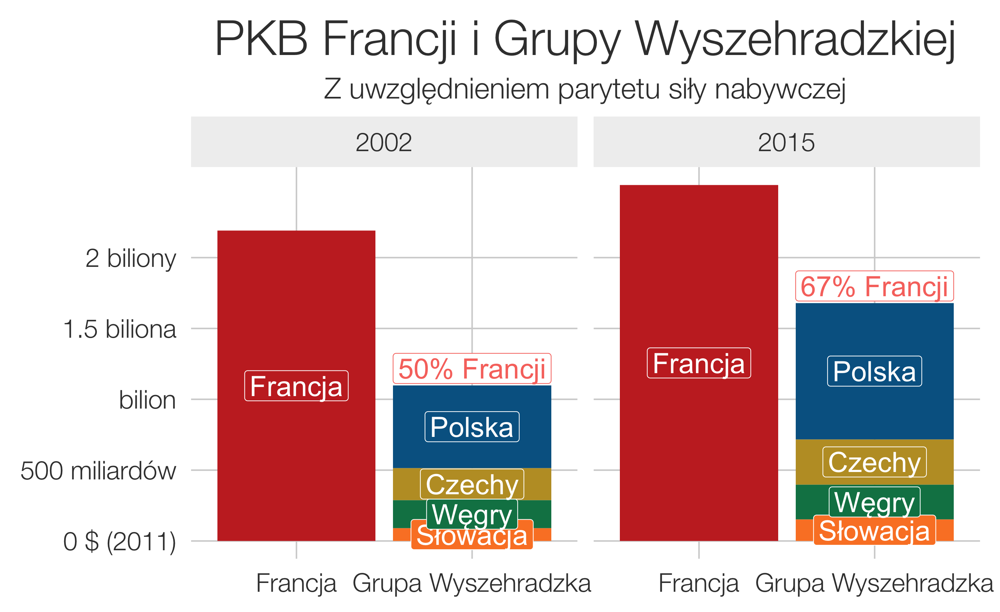
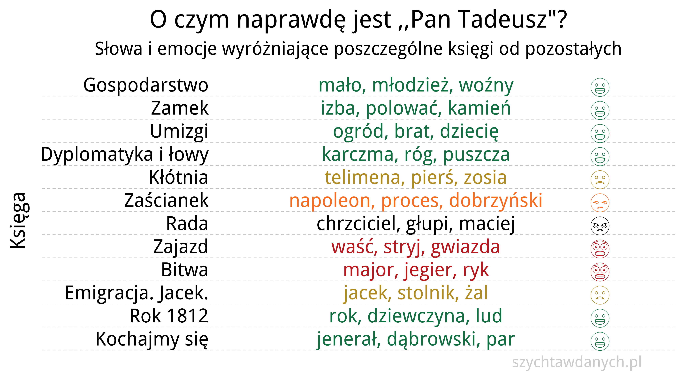
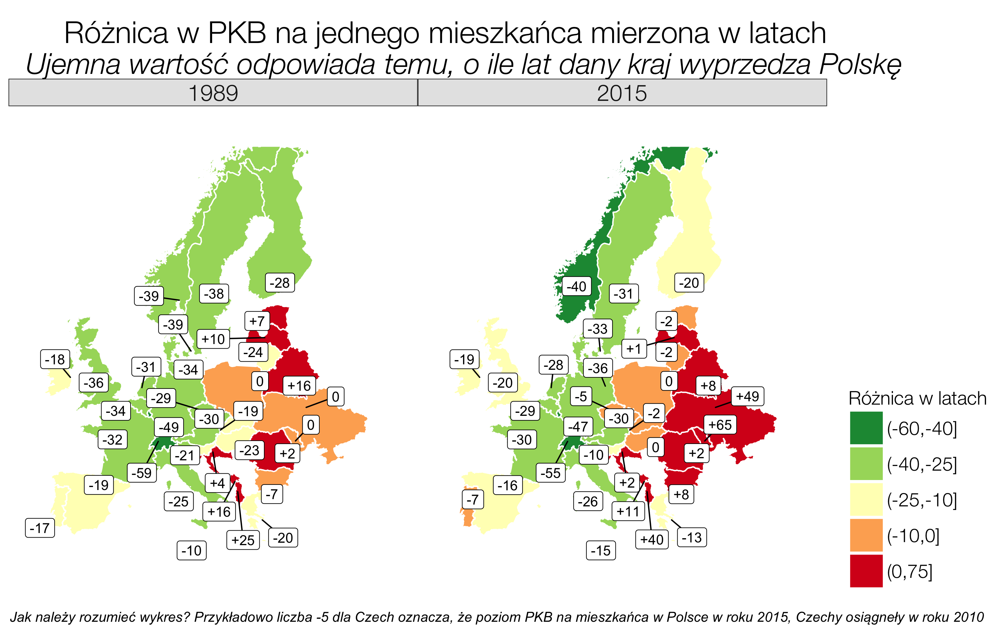

---
title       : Piękniej!
subtitle    : 10 trików w ggplot2
author      : Piotr Sobczyk
date        : "28 września 2017"
job         : szychtawdanych.pl
logo        : cropped-szychta_logo_duze.jpg
biglogo     : migracje_2015.png
framework   : io2012        # {io2012, html5slides, shower, dzslides, ...}
highlighter : highlight.js  # {highlight.js, prettify, highlight}
hitheme     : github      # 
widgets     : [mathjax]            # {mathjax, quiz, bootstrap}
mode        : selfcontained # {standalone, selfcontained, draft}
knit        : slidify::knit2slides


---.big-background-slide
## Dlaczego warto ,,dopieszczać" wykresy?

> * <font size="6">Wizualizujemy, żeby wywrzeć wpływ </font>
> * <font size="6">Tworzymy rzeczy piękne </font>
> * <font size="6">Zmiana danych nie oznacza pracy od zera </font>


---.background-slide
## Od kopciuszka do trochę mniej kopciuszka

<div style='text-align: center;'>
    
</div>

---.background-slide
## Od kopciuszka do trochę mniej kopciuszka

<div style='text-align: center;'>
    
</div>

---.background-slide
## Od kopciuszka do trochę mniej kopciuszka

Zamiast wybierać kolory samemu korzystamy z pracy lepszych od nas

```{r, eval = FALSE}
library(ggthemes)
	scale_fill_wsj() +
	theme_wsj()
```

```{r, eval = FALSE}
	scale_fill_fivethirtyeight() +
	theme_fivethirtyeight()
```

Żeby było białe tło

```{r, eval = FALSE}
theme(panel.background = element_rect(fill = "white"),
      plot.background = element_rect(fill = "white"),
      legend.background = element_rect(fill = "white"))
```

---.background-slide
## Od kopciuszka do trochę mniej kopciuszka

Nie trzeba formatować danych, żeby frakcje przedstawić jako procenty

```{r, eval = FALSE}
scale_y_continuous(labels = scales::percent)
```

Oczywiście to samo tyczy się nie tylko samych etykietek, ale też całej osi

```{r, eval = FALSE}
scale_y_log10()
```

---.background-slide
## Od kopciuszka do trochę mniej kopciuszka

Co jeśli etykietki na osi x na siebie nachodzą?
Zaproponuję dwa rozwiązania

```{r, eval = FALSE}
theme(axis.text.x = element_text(size = 18, face = "plain", angle = 90)
```

Można też wstawić nowe linie w tekst (wymaga transformacji danych).
Tutaj w notacji pakietu *dplyr*

```{r, eval = FALSE}
dane <- dane %>%
	mutate(kolumna_dlugie_stringi = stringr::str_wrap(kolumna_dlugie_stringi, 40))
```

---.background-slide
## Rysowanie strzałek i tekstów

<div style='text-align: center;'>
    
</div>

Co zrobić, żeby nie rozjeżdżały się kąty?

```{r, eval = FALSE}
coord_fixed(ratio)
```

---.background-slide
## A jeśli chcemy odwrócić osie?
<div style='text-align: center;'>
    
</div>

```{r, eval = FALSE}
coord_flip()
```

---.background-slide
## Animacje z ggplot

```{r, eval = FALSE}
library(animation)

saveGIF(expr = {
	for (year0 in seq(2002, 2050, 1)){
		temp = dane %>% filter(year==year0) 
		p <- ggplot(temp) +
			...
		plot(p)
	}
}, movie.name = "nazwa.gif", interval=0.2, ani.width=800, ani.height=600)
```

---.background-slide
## Przejrzystość wykresu

<div style='text-align: center;'>
    
</div>

Białe etykiety na tle słupków

```{r, eval = FALSE}
geom_label(aes(y=srodek, label = country), color = "white", size = 7)
```

Przejrzysta czcionka

```{r, eval = FALSE}
theme_fivethirtyeight(base_size = 23, base_family = "Helvetica Neue Light")
```

---.background-slide
## Emotikony

<div style='text-align: center;'>
    
</div>

---.background-slide
## Emotikony

```{r, eval = FALSE}
library(emojifont)
emoji_labels <- data.frame(emotion =  c("Happiness", "Sadness", "Disgust", "Anger", "Fear"),
                          emoji = c(emoji("smiley"), emoji("frowning_face"), 
                              emoji("unamused"), emoji("angry"), emoji("fearful")),
                          emoji_name = c(("smiley"), ("frowning_face"), 
                              ("unamused"), ("angry"), ("fearful")), stringsAsFactors = FALSE)
dane %>%
	inner_join(emoji_labels, by = "emotion")

plot + 
	geom_text(aes(x = 13-id, y = 11, label = emoji, color = emotion),
            family = "EmojiOne", size = 11, nudge_x = 0.2) +
```

---.background-slide
## Mapy

<div style='text-align: center;'>
    
</div>


---.background-slide
## Mapy

Nienakładające się labelki

```{r, eval = FALSE}
library(ggrepel)
plot +
	geom_label_repel(data = capitalsData, aes(x=LON, y=LAT, 
		label=ifelse(lag>0, paste0("+", lag), lag)))
```

Mapy, a nie wielokąty

```{r, eval = FALSE}
plot + 
	coord_map()
```

---.background-slide
## Mapy

<div style='text-align: center;'>
    
</div>

---.background-slide
## Mapy

```{r, eval = FALSE}
plot +
	geom_curve(data = plotData,
						 mapping = aes(x = LON.x, y = LAT.x, xend = LON.y, yend = LAT.y, 
						 							color = continent.x, size = migrants, alpha = migrants),
						 curvature = 0.5, angle = 90, ncp = 5,
						 arrow = NULL, lineend = "butt", na.rm = FALSE, show.legend = NA) +
	coord_fixed() +
```

--- {
 tpl: thankyou, 
 social: [{title: Blog, href: "http://szychtawdanych.pl/"},
  {title: Github, href: "https://github.com/psobczyk"}]
}

## Dziękuję za uwagę
